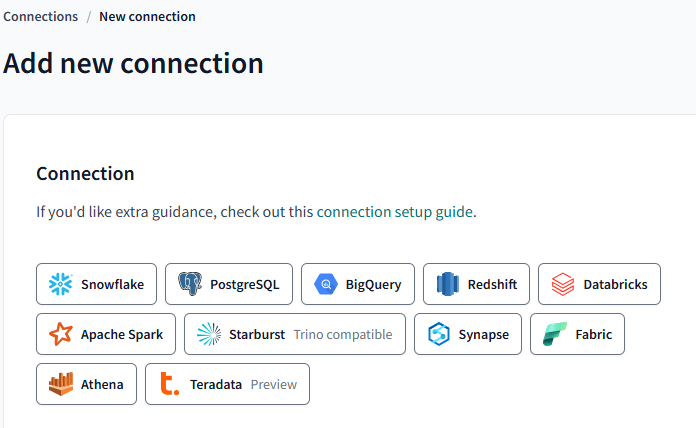
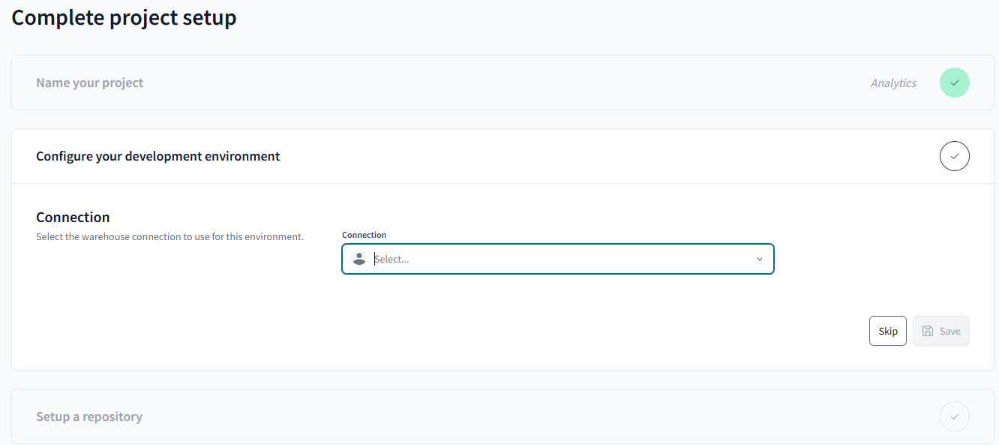
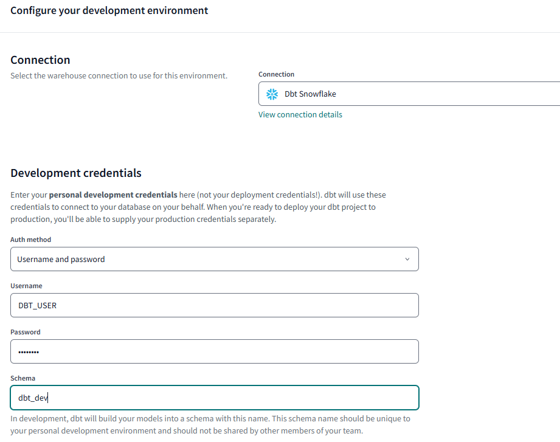

# Setup DBT

In order to learn DBT, you can set up Free account in [DBT Cloud](https://www.getdbt.com) and sign up using Start 
Free button. You can sign up using any email address. The free account will give one developer seat with upto 3000 
models per month and it's more than enough to learn DBT without setting up DBT locally. I will also show how to set 
up local DBT environment.

## Configuring Account

In Free account, you're limited to one project in DBT cloud. You can set up new Connection Data Source by navigating 
to Deploy -> Data Sources -> Connections. You can click on Connection dropdown and select Add new Connection. Here, 
you will see options to configure connection to multiple different data sources.

While setting up the connection, you need to provide ACCOUNT which is the part of the URL for your Snowflake 
instance. For example, in URL `https://dzedxow-au92021.snowflakecomputing.com/` the ACCOUNT is `dzedxow-au92021`. 
The DATABASE field will be `DBT_SNOWFLAKE`, the role will be `DBT_ROLE` and the warehouse will be `COMPUTE_WH` while 
leaving OAuth Method as empty. Now, if you navigate back to the Dashboard, you should see the `Complete project 
setup` option with default project `Analytics`.

Here, from the Connection dropdown, select the new Snowflake connection you created, you will see Development 
Credentials option. Here, you can choose the Username and password option. Alternatively, you could also choose the 
key pair option for development credentials. You can provide the username and password for the user you created earlier.

Next, you may have to intergrate one of the Git providers. In my case, I have integrated with Github and provided 
permission for dbt cloud to access only specific repository `dbt-snowflake`. You simply 
have to login to the Git provider and Authorize DBT to access the repositories. If you skipped this step then you 
can go back to this by navigating to Account Settings -> Projecs -> Analytics -> Configure Repository and select the 
repository. Next, to develop the code, you can use built in Cloud IDE in DBT cloud. Navigate to Develop -> Cloud IDE 

