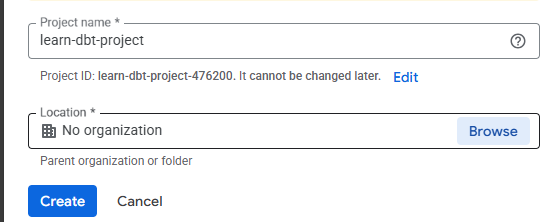
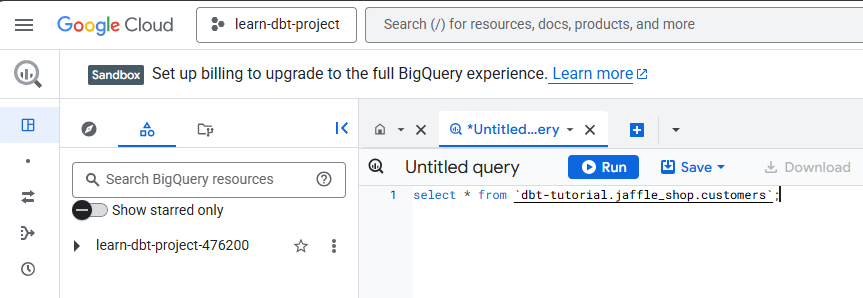
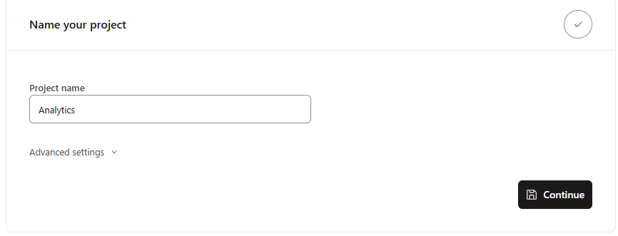
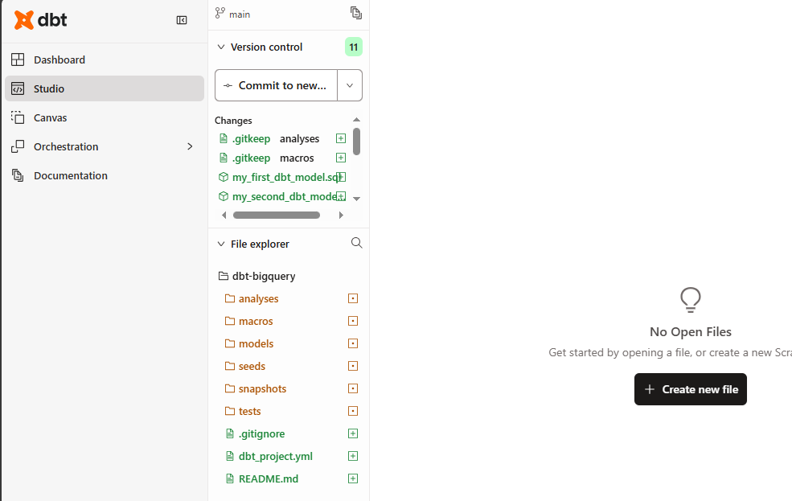

# DBT Setup with BigQuery

In order to work with GCP BigQuery, you need GCP account. You can sign up for free GCP account at [Google Cloud Console](https://console.cloud.google.com/).

## Create GCP Project

First, you need a GCP project created in your account. GCP project is like a container for all your GCP resources. 
You can create a new project by clicking on **Create Project**. You can search **Create a Project** in the search 
bar at the top.

.

Once you've created a GCP project, make sure your current project is setup to the newly created project by choosing 
the correct project at the top.


### BigQuery Service

Now, navigate to the BigQuery UI by choosing BigQuery service in the left side menu.

DBT also provides public dataset which you can use to learn DBT. So, on BigQuery UI, you can run below query to see 
your project setup is fine. You can run the query by clicking on the **Run** button at the top.

```sql
select * from `dbt-tutorial.jaffle_shop.customers`;
```



### Set up BigQuery Credentials

In order to connect DBT to your GCP project, you need to set up BigQuery credentials. 
1. In GCP, you can set up 
credentials under a service called **IAM and Admin**. So, navigate to the IAM and Admin service from the left side 
menu. 
2. Click on **Service Accounts** in the left menu and then click on **Create Service Account.

3. Here, enter following details:

- **Service Account Name**: `dbt-user`. This will automatically populate your service account ID.
- **Description**: Service account for BigQuery access using DBT

4. Click **Create and Continue**.

5. Next, for Permissions, assign BigQuery Admin role to this service account.


6. Under Principals with access, leave it blank and click **Done**.

7. Now, you will see your service account created in the UI. click on the service account name and select **Keys** tab 
at the top.
8. Next, click **Add Keys** and select "Create new key".
9. Select JSON as key type and click "Create".
10. This will automatically save the JSON key file locally. Save it carefully as `dbt-user.json` file. This will be 
    required to 
    setup 
    connection to BigQuery in DBT project.

## Create DBT Project

To work with DBT, you can set up local DBT, but easiest way to work with DBT is to use DBT Cloud. You can create 
a free DBT 
account 
with 
[DBT 
Website](https://getdbt.com), you can create a new 
project. By default, it will create a project named **Analytics** in your account.



Next setup section will ask for Connection details. Here, you can click on **Add New Connection** and select 
**BigQuery**


Here, to setup connection, you can simply click on **Upload a Service Account JSON file** and select the file you 
saved earlier.


This will populate all the required fields automatically. There are few optional settings fields that you could set 
up if you want otherwise simply click **Save** at the top.

The next step is to setup Github repository. You can authenticate with Github using the Github integration in DBT 
cloud. You can go to Account Settings -> Projects -> Analytics -> Configure Repository and select the repository.

The next step is to Initialize DBT project. You can navigate to the **Studio** in DBT cloud and click on 
**Initialize dbt project** to create initial scaffolding for your DBT project.

Once initialized, you will see several files created in the DBT project.



At this point, you can verify your integration with Github by clicking on "Commit" at the top and provide message 
"Initial project setup" and click "Commit changes".

## Overview of DBT Cloud options

DBT cloud is fully integrated service which provides tools for Data engineers to work with DBT. DBT Studio is a web 
based development environment. Here, you can edit your models, schemas and other project files. It also provides 
integration with Git to commit your changes. 

Under Orchestration, you have option to create a new environment. There are General, Staging and Production 
environments. In terms of Environment types, you can create an environment of type Development or Deployment.

- **Development**: This environment is used for development and testing of your DBT project.
- **Deployment**: This environment is used for production deployment of your DBT project. This is where end users 
  interact with your DBT project.

The **Jobs** section is used to create and manage jobs. You can create a job. You can also create a scheduled job 
which will run the job at a specific time. Under the **Runs** section, you can see all the runs of your jobs. You 
can also see the status of your jobs.