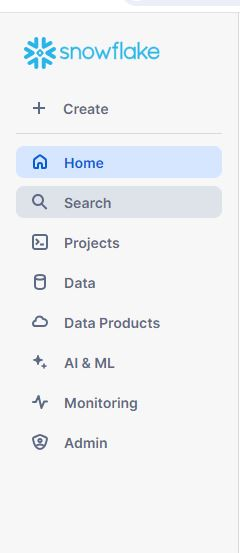

# Snowflake Introduction

Snowflake is built natively for the cloud from the ground up.

Snowflake capability has increased with the introduction of Snowpark. Snowpark is developer framework that brings new data programmability to the cloud and makes it possible for developers, data scientists and data engineers to use Java, Scala or Python to deploy code in a serverless manner. Snowflake comes with web UI called Snowsight.

You can sign up for Snowflake Trial account to get 30 days trial. When you create a new account, you will assigned `ACCOUNTADMIN` role. On the left side, you can see the main menu where you can see options like Projects, Data, Data Products, etc.

