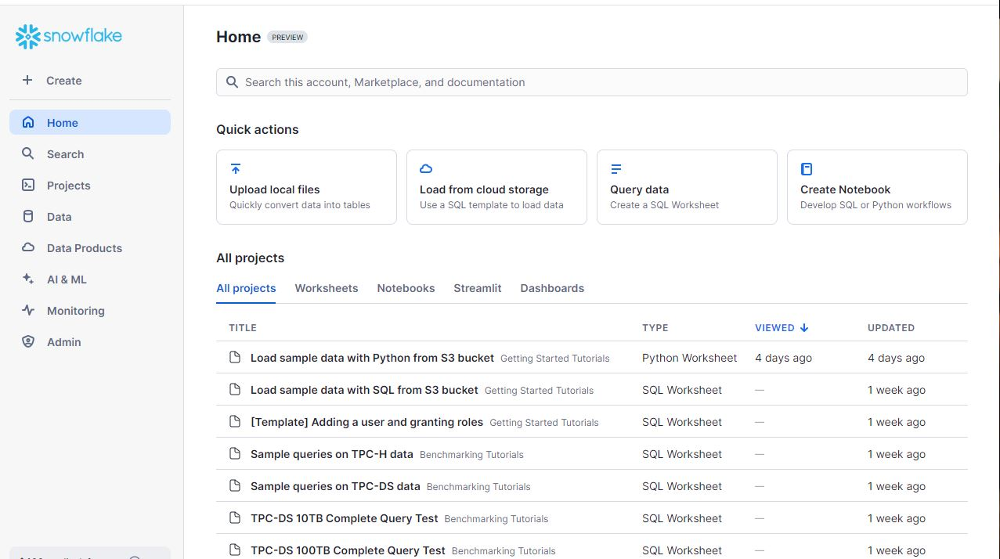
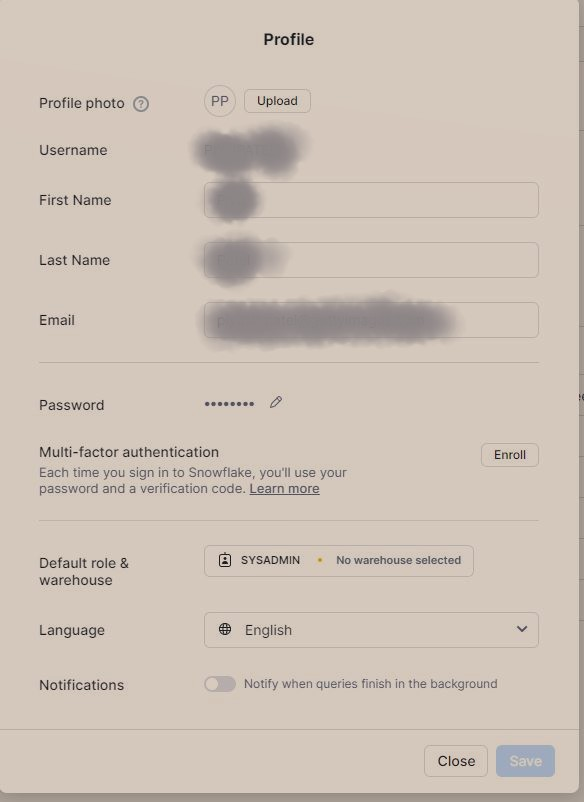
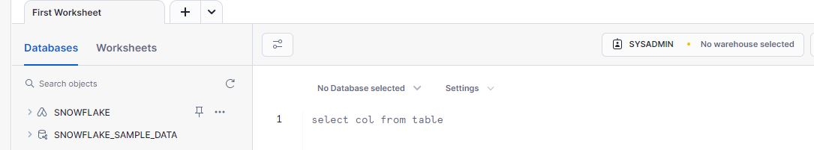
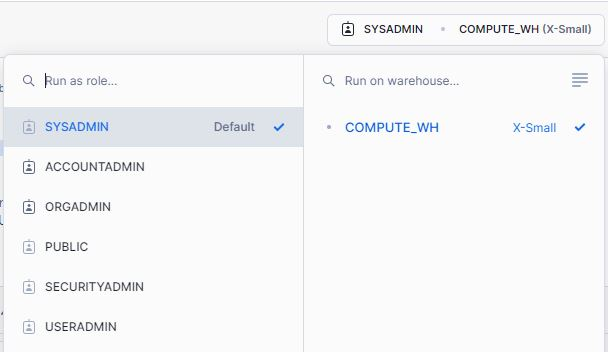

# Snowflake Account Setup

In order to learn Snowflake, you need to have Snowflake account. You can sign up for free trial of Snowflake at [this link](https://signup.snowflake.com). It will simply ask you for your account information and once you've provided those, you will be sent a confirmation link. Once confirmed, you will get your account set up link which will be your personal snowflake instance. Snowflake is SaaS product so you don't need to install any software in order to work with it.


When you create a new account, you will assigned `ACCOUNTADMIN` role which is the most powerful role in Snowflake. You should always use the roles which provides just enough permissions to perform the task. Your current role determines what you can do in Snowflake.

## Tour of Snowflake UI

The new Snowflake UI is called Snowsight. On the left side, you can see the main navigation menu where you can see options like Projects, Data, Data Products, AI/ML, Admin, etc.


At the top of the UI, you can see Search option where you can discover content from Data products, databases, views, tables, procedures etc. Below the search bar, you have Quick Actions which is a short cut to perform the common operations in the UI. Here, you will see options such as Uploading a file, Loading data from Cloud storage, Quering data, etc. The last part in the middle of UI is horizontal tabbed navigation where you see Worksheets, Notebooks, Strimlits and Dashboards for your Snowflake instance.



You can click on your username and select **Switch Role** and switch to `SYSADMIN` role in the Snowflake UI. Under the option of **My Profile**, you can set up multi-factor authentication (MFA) or in your free trial, you can change your password if needed. You can also setup your Default database and warehouse to run your queries.



Next, create new worksheet by either clicking on "Go to Worksheets" in Worksheets tab in the main section of the UI or by clicking on "Projects > Worksheets". This will bring you to all worksheets area. Here, you can click on the plus icon on the top right corner or click the dropdown next to it and select "SQL worksheet". This will create a new worksheet with the name as current date and time, you can double click the name of the sheet at the top and rename them. 



Alternatively, you can hover over this sheet and you will see more options as three dots. Just click on this and you will many other options.


Next, type below query in your worksheet.

```sql
SELECT CURRENT_ROLE();
```

In order to execute this command, you can run the command by using arrow button on the top right corner of the UI. Next, type below commands right below this command.

```sql
SELECT CURRENT_WAREHOUSE();
SELECT CURRENT_DATABASE();
```

Now, if you want to execute one command, you can put your cursor on the line which you want to execute. You can hit Run and it will run that specific command. You can also run all commands in the current worksheet using shortcut `Ctrl + Shift + Enter` keys. For now, you will see the current warehouse is `null` and even current database is `null`. By default in latest Snowflake accounts, `SYSADMIN` role is not assigned permissions to use the default warehouse `CURRENT_WH`. To provide this role the permission, execute below command using `ACCOUNTADMIN` role because only that role has permission to use this warehouse.

```sql
GRANT USAGE ON WAREHOUSE COMPUTE_WH TO ROLE SYSADMIN;
```

Now, select the role of `SYSADMIN` at the top along with `COMPUTE_WH` as the default warehouse.



If you wish, you can make this the default in your profile preferences. This will make sure every time you create a new worksheet, you will have warehouse and role correctly selected.

With Snowflake, you also get auto-suggestion feature which will help you write your queries faster. You can use 
`Ctrl + Space` to see the suggestions. The auto-suggestions are based on the context of the query you are writing. 
For example, if you are writing a query to select from a table, it will suggest you the columns in that table.

```sql
USE DATABASE SNOWFLAKE_SAMPLE_DATA;
USE SCHEMA TPCDS_SF100TCL;
SHOW TABLES;
```

You can also select and view all available tables in a schema from the UI on the left hand side.

First thing you need in order to work with Snowflake is database. A database in snowflake contains multiple schemas which is like a grouping construct for tables. Each schema may contain one or more tables in them.

In the next lesson, we will learn how to create a database and schema in Snowflake.