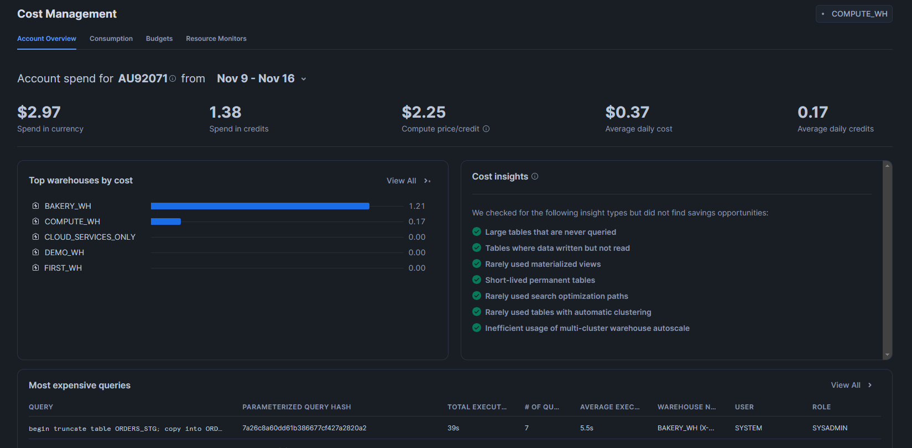
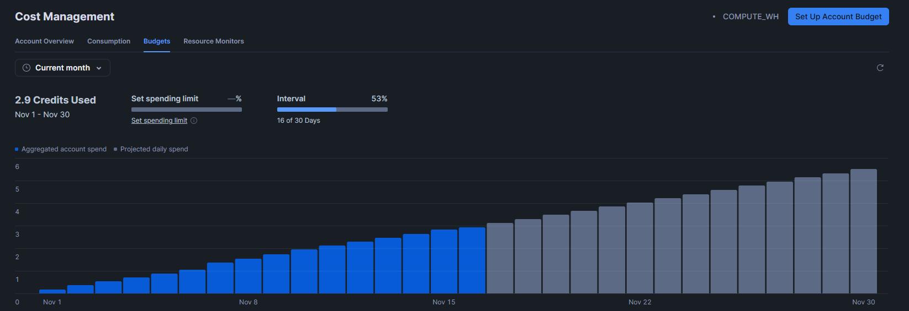

# Usage Monitoring

In order to monitor the usage on Snowflake account, you need to use either `ACCOUNTADMIN` role or a role that has been granted `MONITOR USAGE` privilege. The `MONITOR USAGE` privilege allows you to monitor the usage of the account and the objects in the account. 

In Snowflake UI, you can go to Admin -> Cost Management to see the usage of the account. You can see top 
warehouses by cost and top databases by storage. You can also view cost for last 7 days, last 30 days, and last 90 
days. You will also see the queries which cost most in the Account Overview tab. 

You can also go to Consumption tab 
to see the costs by Compute, Storage or Data Transfer by choosing the dropdown of Resources and see them as a bar 
chart. Here, you can also filter the consumption by warehouse and any tags. Tags are similar to other cloud 
providers which is used to group data into several categories. 

The Budgets tab allow you to 
set up 
Account budget so 
that you get notified if the account exceeds the budget.
This is very helpful when you have fixed amount of budget and you want to keep track of the usage.

Once you click on `Set up Account Budget`, you can provide the credits for the budget and the email address to send 
alerts to when the usage exceeds the budget set up in the alert.

The Resource Monitors tab allow you to set up resource monitors to monitor the usage of single warehouse or group of 
warehouses or account. The Resource Monitor can be set up only by `ACCOUNTADMIN` role. It is used to control and 
monitor the 
credits 
usage by warehouses 
and account. You can 
set up 
resource monitor by clicking on the `Resource Montiros` tab and then clicking on `Create Resource Monitor`.

Here, you can provide the name of the resource monitor, the credit limit, the monitor type which can be a single 
warehouse, group of warehouses or an account. The schedule option allows you to set up the schedule when the credits 
quota is reset. By default, this resets every month. Next, you have set of Actions that you can set up when this 
quota is exceeded. There are three options at the moment.
1. Notify: This will send email notification when the percentage quota is exceeded.
2. Suspend: This will suspend the warehouse when the percentage quota is exceeded. It will first finish the existing 
   queries and then suspend the warehouse.
3. Suspend Immediately: This will suspend the warehouse immediately when the percentage quota is exceeded without 
   waiting for existing queries to finish.

